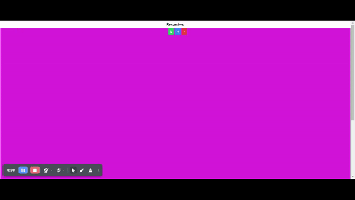
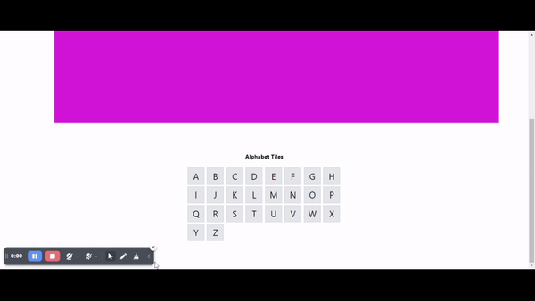

# ayykori.net  Job Task (mid label Fullstack developer)


Recursive Partitioning Layout Builder:

ধাপসমূহ:

1. ##### প্রাথমিক পার্টিশন রেন্ডার করুন: 
একটি এলোমেলো ব্যাকগ্রাউন্ড রঙ সহ একটি প্রাথমিক পার্টিশন দেখান। এর ভেতর 'V' (Vertical split) এবং 'H' (Horizontal split) নামে দুটি বোতাম থাকবে।

2. ##### বাটন ক্লিক ইভেন্ট হ্যান্ডলার যুক্ত করুন:

- 'V' বাটনে ক্লিক করলে প্রাথমিক পার্টিশনটি দুটি অংশে ভেঙে যাবে—লম্বাভাবে।
- 'H' বাটনে ক্লিক করলে পার্টিশনটি অনুভূমিকভাবে বিভক্ত হবে।
##### রঙের নিয়ম:
 স্প্লিট করার পর পুরানো পার্টিশনটি তার রঙ ধরে রাখবে, আর নতুন পার্টিশনটি নতুন এলোমেলো রঙ পাবে।

ফারদার স্প্লিট এবং রিমুভ: প্রতিটি নতুন পার্টিশনও আবার ভেঙে স্প্লিট করা যাবে এবং যে কোনো পার্টিশনকে একটি '-' বোতাম দিয়ে সরিয়ে ফেলা যাবে।

##### রিসাইজিং: 
প্রতিটি পার্টিশনকে ক্লিক এবং ড্র্যাগ করে রিসাইজ করার ব্যবস্থা করুন, যেখানে পার্টিশনগুলো 1/4, 1/2, এবং 3/4 রেশিওতে স্ন্যাপ করতে পারে।


Alphabet Tile Interaction:


ধাপসমূহ:

##### অ্যালফাবেট টাইলস তৈরি করুন: 
'A' থেকে 'Z' পর্যন্ত প্রতিটি অক্ষরের জন্য একটি করে টাইল তৈরি করুন এবং গ্রিড লেআউট ব্যবহার করুন।

##### ক্লিক ইভেন্ট হ্যান্ডলার:
 যখন একটি টাইল ক্লিক করা হবে, সেই টাইলের অক্ষরটি একটি স্ট্রিংয়ের সাথে যুক্ত হবে এবং HTML এলিমেন্টে দেখানো হবে।

##### কনসিকিউটিভ লেটার রিপ্লেসমেন্ট: 
যদি টানা তিনটি একই অক্ষর ক্লিক করা হয়, তাহলে সেই অক্ষরগুলোকে 'underscore' () দিয়ে প্রতিস্থাপন করুন। 3টির বেশি একই অক্ষর হলে সেগুলোকে উপযুক্ত সংখ্যক '' দিয়ে প্রতিস্থাপন করুন।

##### উদাহরণ আউটপুট:

ক্লিক: "A", "B", "C", "F", "F", "F", "G" ->   আউটপুট: ABC_G

ক্লিক: "A", "A", "A", "A", "A", "A", "B" -> আউটপুট: _B


## Description
- **Recursive Partitioning Layout Builder/Alphabet Tile Interaction** 

React vite Basic setup, Floder setup,React-router-dom setup, tailwindcss setup,
- এই অ্যাপ্লিকেশনটি তৈরি করতে react-rnd npm প্যাকেজ ব্যবহার করা হবে, যা পার্টিশনগুলোকে রিসাইজ এবং ড্র্যাগ করার সুবিধা দেবে।

- Hope this helps everyone.

## Getting Started

To clone and run this application, you'll need Git and Node.js (which comes with npm) installed on your computer. From your command line:

1. Clone the repository:

   ```bash
   git clone https://github.com/TomorChandraRoy/ayykoriJobTask.git
   ```

2. Navigate to the project directory:

   ```bash
   cd your project directory
   ```

3. Install the required dependencies:

   ```bash
   npm install
   ```

4. Start the application:

   ```bash
   npm run dev
   ```


### Dependencies

* এই অ্যাপ্লিকেশনটি তৈরি করতে React.js,react-router-dom,react-rnd,tailwindcss ব্যবহার  করা  হয়েছে। 


## Authors

Contributors names and contact info

ex. Tomor Chandra Roy  
ex. [@Tomor Chandra Roy[Linkedin]](https://www.linkedin.com/in/tomor-chandra-roy/)

## Version History

<!-- * 0.2
    * Various bug fixes and optimizations
    * See [commit change]() or See [release history]()
* 0.1
    * Initial Release -->

## License

This project is licensed under the [Tomor Chandra Roy] License - see the LICENSE.md file for details

